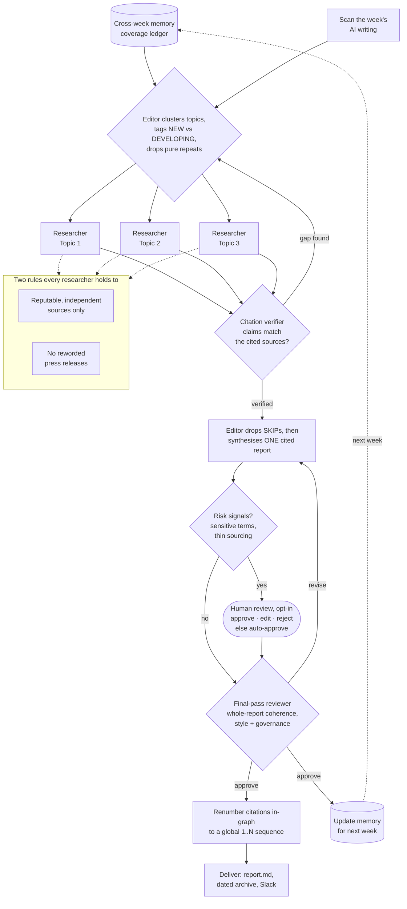

# Throughline

[](https://github.com/joel-langchain/throughline/actions/workflows/ci.yml)

_Find the thread through the week's AI noise._

A weekly AI-news agent. It reads across the week's writing and returns **one
cited report**: what actually happened, where the market is moving, and what's
worth paying attention to. It cuts through volume the way a small editorial team
would — an editor delegates each topic to a researcher, then synthesises the
results.

## Built as four loops

Throughline is built as **four nested loops of agent engineering**, each one
wrapping the last (framing from LangChain's
[Art of Loop Engineering](https://www.langchain.com/blog/the-art-of-loop-engineering)).
It's worth designing for all four from the start, even the ones you build later.

| Loop | What it does | Status |
| --- | --- | --- |
| **1 · Agent loop** | Editor clusters the week into topics; parallel researchers gather sources; synthesise one cited report | ✅ built |
| **2 · Verification loop** | Verifier checks claims against their sources, re-researches gaps, drops what can't be backed; deterministic citation numbering | ✅ built |
| **3 · Event loop** | Deployed on LangGraph Platform; a weekly cron runs it unattended and delivers the report to Slack | ✅ live |
| **4 · Improvement loop** | Golden-set evals + reference-free evaluators + tracing gate changes; online evaluators and reuse via assistants next | 🛠 building |

---

## Loop 1 — the agent loop

The editor (a strong model) clusters the week's writing into the topics that
emerge from the data, then delegates each to its own researcher **in parallel**,
each in an **isolated context**. Bulky raw search text is quarantined in each
researcher's scratch folder so it never floods the editor's context.



### The two rules the system holds to

1. **Reputable, independent sources only** — researchers and analysts, not vendor
   blogs. Company posts are treated as claims, not facts. Known press-release /
   wire domains are dropped before a researcher ever sees them (`sources.toml`).
2. **No reworded press releases** — if a topic's only substance is a reworded
   announcement, the researcher returns `SKIP` and it doesn't go in the report.

### Cross-week memory (the agent's context)

Throughline remembers what it has already covered, so the weeks build on each
other instead of repeating. Before each run the editor reads a running coverage
ledger; when it clusters the week it tags every topic **NEW** or **DEVELOPING**,
drops pure repeats, and for a developing storyline leads with *what actually
changed*. After the run it updates its own memory.

Memory is just files under the agent path `/memories/` (the deepagents
convention): `coverage.md` (the running ledger) and `this-week.json` (a
structured record of the latest week). Locally the runner mirrors `/memories/`
to the `memory/` folder either side of a run; on a deployment that same path is
routed to a persistent `StoreBackend` (via a `CompositeBackend`) with **no change**
to the agent's prompt or paths — see [Loop 3](#loop-3--the-event-loop).

---

## Loop 2 — the verification loop

Once researchers report back, the editor drops the `SKIP`s (the quality gate),
then each kept topic is checked before it can reach the report:

- **Citation verification** — a verifier subagent checks each kept topic's claims
  against its quarantined sources. On a `FLAG`, it re-dispatches the researcher to
  close the gap and re-verifies (a bounded re-research loop); any claim that still
  can't be backed is dropped.
- **Final-pass review** — a reviewer reads the assembled report end to end and
  `APPROVE`s or `REVISE`s for whole-report coherence, style, and governance.
- **Human-in-the-loop (opt-in)** — when the report trips a risk signal (sensitive
  terms, thin sourcing, or the editor's own uncertainty) it can pause for a human
  to approve / edit / reject. Off by default so unattended runs never block; clean
  weeks publish untouched.
- **Deterministic citation numbering** — the editor cites each claim by source
  URL and a step **inside the graph** assigns a global `1..N` sequence, rebuilding
  the Sources list into a guaranteed 1:1 mapping. Numbering is mechanical work
  taken out of the model (where it used to drift), and running it in-graph means a
  headless run finalises its own report — no host post-processing.

---

## Loop 3 — the event loop

Deploying wraps the graph in the full LangGraph Server API — assistants, threads,
runs, **crons**, and the Store — so a schedule (or an external event) can run the
whole workflow without you. You don't build the scheduler; you deploy and it comes
with it.

On a deployment the agent differs from a local run in three deliberate ways, all
handled in `build_agent` — the prompt and paths stay identical:

- **Persistent memory** — `/memories/` is backed by the platform's Store, so weeks
  build on each other across scheduled runs with no local disk.
- **Unattended** — the human-review interrupt is off, so a risk-flagged report is
  auto-finalised rather than pausing forever with no human to resume it. The risk
  checks and in-graph citation renumbering still run.
- **Today's date, injected in-graph** — the report title and the week-keyed memory
  need the current date, which a model doesn't know. A middleware supplies it at
  run time, so a cron created once dates each week correctly.

**Delivery.** Each finished run posts the report to Slack when `SLACK_WEBHOOK_URL`
is set — so a scheduled run lands somewhere readable without a laptop. It also
lands in the run's LangSmith trace. See [Deploy your own](#deploy-your-own) to set
it up.

---

## Loop 4 — the improvement loop

Using what happens in real runs to make the system better over time.

- **Evals** — a frozen-week golden dataset with planted defects, scored by
  **reference-free evaluators** (citation integrity, source quality, groundedness,
  dedup, editorial voice). Because they read only the report, the same evaluators
  grade the golden set offline *and* live traces online.
- **CI gate** — a GitHub Actions workflow runs the golden set through those
  evaluators on every push and PR, offline (no LangSmith, no secrets). It fails the
  build if an evaluator stops catching its planted defect or starts firing on the
  clean report — so a change that quietly weakens the evals can't merge. Lint
  (ruff) and a `langgraph validate` job run alongside it. `main` is protected and
  changes land by PR with **auto-merge on green**, so the gate — not a human —
  decides what reaches the deployment.
- **Tracing** — every run is traced end to end in LangSmith.

**Next in this loop:** online evaluators scoring production runs as usage grows;
reuse via **assistants** (so others can spin up their own Throughline — their
topics, sources, models, cadence — against the same deployment without forking);
and a forecasting / self-evaluating prediction loop. See the [Roadmap](#roadmap).

---

## Setup

```bash
cd throughline
cp .env.example .env      # then fill in TAVILY_API_KEY and ANTHROPIC_API_KEY
uv sync
```

## Run locally

```bash
uv run python -m throughline.run            # auto-approve (default)
uv run python -m throughline.run --review   # pause for human review on risk
```

By default the run is unattended: if the report trips a risk signal it is
auto-approved and the reason is logged. Pass `--review` (or set
`THROUGHLINE_REVIEW=1`) to decide interactively.

The finished report lands in `output/report.md`, with a dated copy in
`output/reports/<YYYY-MM-DD>.md` so past weeks accumulate. Each researcher's raw
archive is mirrored under `output/research/<topic>/`, and cross-week memory lives
in `memory/`.

## Tests

```bash
uv run pytest        # offline golden-eval gate + delivery/config/graph tests
uv run ruff check .  # lint
```

The golden-eval gate (`tests/test_golden_evals.py`) asserts the clean report
passes every evaluator while each planted defect is caught by exactly its target
evaluator — no LangSmith, no API keys. The same suite runs in CI
(`.github/workflows/ci.yml`). The richer LangSmith-tracked experiment
(`uv run python -m evals.run_evals`) still exists for history and the LLM voice
judge.

## Deploy your own

The deployable graph is `throughline.agent:agent`, declared in
[`langgraph.json`](langgraph.json).

**Validate the config** (no account needed):

```bash
uv sync --group deploy
uv run langgraph validate      # checks langgraph.json + that the graph imports
uv run langgraph dev           # optional: serve the same graph locally
```

**Deploy** — two routes:

- **From the CLI** (quick bring-up): `uv run langgraph deploy` builds and ships the
  image to LangSmith Deployment (auth with `LANGSMITH_API_KEY`; builds remotely if
  you have no local Docker).
- **From GitHub** (continuous deployment): connect the repo in LangSmith so it
  auto-deploys on push to `main`. This links to the [CI gate](#loop-4--the-improvement-loop)
  — a change only reaches the deployment after the gate passes. For the gate to
  actually *block* a bad change, protect `main` (require the CI checks) so changes
  land via PR.

Set `ANTHROPIC_API_KEY` and `TAVILY_API_KEY` as deployment secrets.

**Model access — direct or via the LLM Gateway.** By default the agent calls
Anthropic directly with `ANTHROPIC_API_KEY`. Alternatively, route model calls
through the [LangSmith LLM Gateway](https://docs.langchain.com/langsmith/llm-gateway)
— one LangSmith key powers tracing *and* the models, no separate provider key:

```
ANTHROPIC_BASE_URL=https://gateway.smith.langchain.com/anthropic
ANTHROPIC_API_KEY=<your LangSmith key>   # on Deployment, LANGSMITH_API_KEY is injected automatically
```

Which models are used is **code config**, not env — edit `WORKER_MODEL` /
`EDITOR_MODEL` in [models.py](src/throughline/models.py). `TAVILY_API_KEY` still
needs a real Tavily key — web search isn't gatewayed.

**Deliver to Slack** (optional). Add a Slack incoming-webhook URL as a deployment
secret and each finished run posts the report to that channel:

```
SLACK_WEBHOOK_URL=https://hooks.slack.com/services/XXX/YYY/ZZZ
```

**Schedule the weekly run** (once the deployment is live):

```bash
export LANGGRAPH_DEPLOYMENT_URL="https://<your-deployment>.us.langgraph.app"
export LANGSMITH_API_KEY="..."
uv run python scripts/create_cron.py            # weekly, Mon 05:00 UTC
```

## Self-host on your own infra

You don't have to use the managed platform. The graph runs as a standard
LangGraph server, so you can build an image and run the whole stack yourself.

A `Dockerfile` and `docker-compose.yml` are committed here (generated with
`uv run langgraph dockerfile Dockerfile --add-docker-compose`). The compose stack
is the agent server plus the two services it needs: Postgres (persistence /
memory store) and Redis (task queue).

```bash
cp .env.example .env      # add ANTHROPIC_API_KEY / TAVILY_API_KEY (+ SLACK_WEBHOOK_URL)
docker compose up         # agent server on http://localhost:8123
```

Two honest caveats: you then own that stack (Postgres, Redis, scaling, backups,
uptime), and the server image needs a licence key (`LANGGRAPH_CLOUD_LICENSE_KEY`,
or a LangSmith key) for production self-hosting. That trade — run and maintain the
infrastructure yourself, or let the managed platform handle it — is the whole
reason [Deploy your own](#deploy-your-own) exists.

## Roadmap

Building in public — grouped by the loop each item belongs to. **Every loop has
open items**: none is "finished", each can be pushed further. Rough order within
each; contributions and ideas welcome.

### Loop 1 · Agent

_Done:_

- [x] Cross-week memory & continuity
- [x] Track storylines week-over-week (what changed, what's new)
- [x] Topic-level cross-week dedup _(source-level still to come)_
- [x] Config-driven source allow/deny lists & scan seeds (`sources.toml`)

_Next:_

- [ ] Configurable scan seeds and topic count
- [ ] More reliable topic selection — consistently surface the week's biggest stories
- [ ] Structured, typed researcher outputs (not just free text)

### Loop 2 · Verification

_Done:_

- [x] Citation verification + bounded re-research loop
- [x] Human-in-the-loop review on risk signals
- [x] Deterministic in-graph citation numbering
- [x] Final-pass reviewer over the whole report

_Next:_

- [ ] Source-level dedup (not just topic-level)
- [ ] Stronger source-tier enforcement (prefer primary / top-tier outlets)

### Loop 3 · Event

_Done:_

- [x] Deployment (LangGraph Platform)
- [x] Persistent-memory Store swap
- [x] Headless in-graph output
- [x] Scheduled weekly cron
- [x] Slack delivery

_Next:_

- [ ] Report format — TL;DR + ranked headlines up top for fast reading
- [ ] More output formats (social teaser, email digest)
- [ ] LinkedIn posting via MCP (draft → review → post)
- [ ] Resilience — retries, rate-limit handling, graceful search failures
- [ ] Cost controls — token budgets and per-run cost tracking

### Loop 4 · Improvement

_Done:_

- [x] Golden-set evals + reference-free evaluators
- [x] Automated tests + CI gate (blocks regressions; auto-merge on green)
- [x] End-to-end tracing

_Next:_

- [ ] Online evaluators scoring production runs as usage grows
- [ ] Reuse via assistants — others configure their own Throughline (topics,
  sources, models, cadence) against the same deployment
- [ ] Forecasting — record predictions each week and score them against what happens
- [ ] Market-movement analysis — where things are heading, not just what happened
- [ ] Chat with the week — Q&A over the report and its research archives

## Notes on safety

- The agent runs on the default ephemeral StateBackend — it never writes to your
  real filesystem. The runner copies files out of agent state with a
  path-traversal guard.
- Web-search text is untrusted; keep that in mind before rendering it anywhere.
