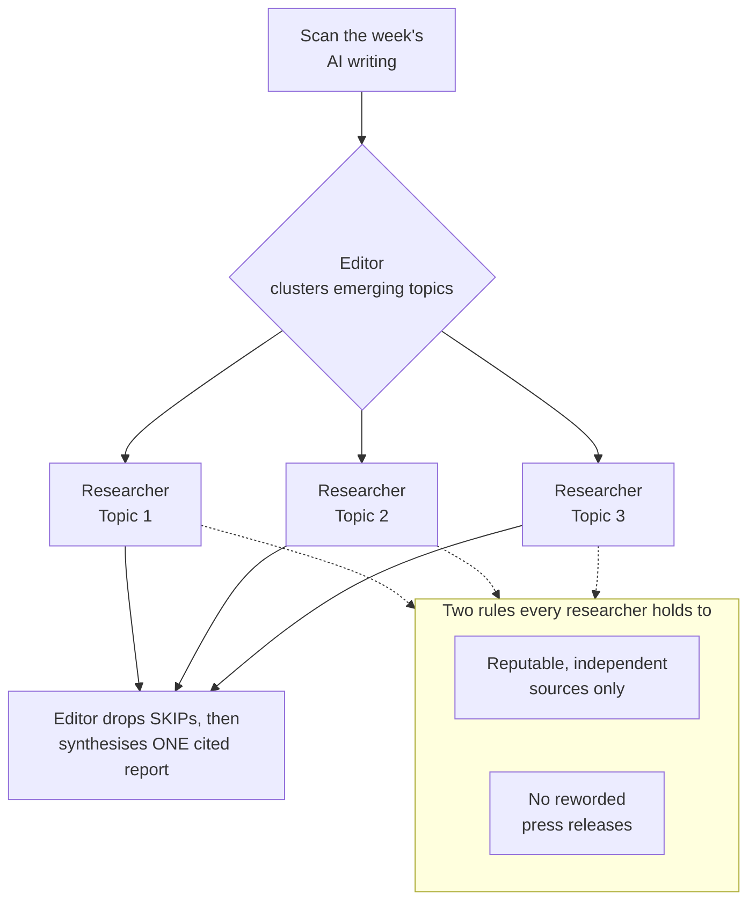

# Throughline

_Find the thread through the week's AI noise._

A weekly AI-news agent. It reads across the week's writing and returns **one
cited report**: what actually happened, where the market is moving, and what's
worth paying attention to.

It cuts through volume the way a small editorial team would — an editor
delegates each topic to a researcher, then synthesises the results.

## Architecture

Built on the [deepagents](https://pypi.org/project/deepagents/) editor +
subagent-team pattern:



```
editor (strong model)
  │  scan_ai_week() once → cluster the week into topics that emerge from the data
  │  delegate each topic in parallel via the task tool
  ├──► topic-researcher (cheap model, own tools + scoped scratch disk)
  │       search reputable sources, quarantine raw hits to
  │       /research/<topic>/sources.md, return one cited summary + KEEP/SKIP
  │       verdict
  └──► ... one researcher per topic ...
  collect summaries → drop the SKIPs (quality gate) → synthesise ONE cited
  report → /output/report.md
```

Why multi-agent: topics are independent, so researchers run **in parallel**, each
in its **own isolated context**. Bulky raw search text is quarantined in each
researcher's scratch folder so it never floods the editor's context.

### Two rules the system holds to

1. **Reputable, independent sources only** — researchers and analysts, not vendor
   blogs. Company posts are treated as claims, not facts.
2. **No reworded press releases** — if a topic's only substance is a reworded
   announcement, the researcher returns `SKIP` and it doesn't go in the report.

## Setup

```bash
cd ai-news-agent
cp .env.example .env      # then fill in TAVILY_API_KEY and ANTHROPIC_API_KEY
uv sync
```

## Run

```bash
uv run python -m ai_news_agent.run
```

The finished report lands in `output/report.md`; each researcher's raw archive is
mirrored under `output/research/<topic>/` so you can inspect what was quarantined.

## Status

Early days. Topic clustering, source-quality filtering, and the press-release
gate are all deliberately simple first cuts and will be refined.

## Roadmap

Building this in public — rough order, not fixed. Contributions and ideas welcome.

**Memory & continuity**

- [ ] Long-term memory — remember what's already been covered so weeks build on
  each other instead of repeating
- [ ] Track ongoing storylines week-over-week (what changed, what's new)
- [ ] Cross-week deduplication of topics and sources

**Trust & quality**

- [ ] Human-in-the-loop review/approve step before anything is published
- [ ] Config-driven source allow/deny lists (currently hard-coded)
- [ ] Citation verification — check that claims actually match the cited source
- [ ] Evals — score reports on source quality, factuality, dedup, and voice

**Publishing**

- [ ] LinkedIn posting via MCP (draft → review → post)
- [ ] Consistent editorial voice as the architecture changes underneath
- [ ] Multiple output formats (report, social teaser, email digest)

**Interaction & intelligence**

- [ ] Chat with the week — Q&A over the finished report and its research
  archives (deep dives, "why keep this?", "show me the primary paper")
- [ ] Suggest follow-up research ideas from what it surfaced
- [ ] Market-movement analysis — where things are heading, not just what happened
- [ ] Forecasting — record explicit predictions each week and score them against
  what actually happens (a self-evaluating prediction loop)

**Operations**

- [ ] Deployment (LangGraph Platform)
- [ ] Scheduled weekly runs (cron)
- [ ] Monitoring & tracing (LangSmith)
- [ ] Cost controls — token budgets and per-run cost tracking
- [ ] Resilience — retries, rate-limit handling, and graceful search failures

**Foundations**

- [ ] Automated tests + CI
- [ ] Structured, typed outputs from researchers (not just free text)
- [ ] Configurable scan seeds and topic count

## Notes on safety

- The agent runs on the default ephemeral StateBackend — it never writes to your
  real filesystem. The runner copies files out of agent state with a
  path-traversal guard.
- Web-search text is untrusted; keep that in mind before rendering it anywhere.
