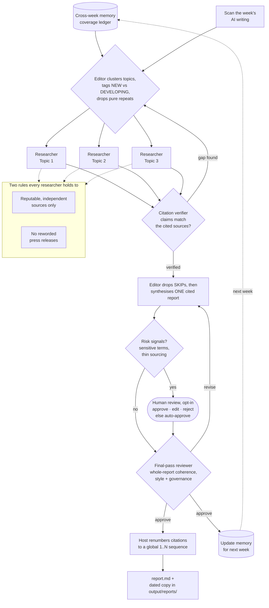

# Throughline

_Find the thread through the week's AI noise._

A weekly AI-news agent. It reads across the week's writing and returns **one
cited report**: what actually happened, where the market is moving, and what's
worth paying attention to.

It cuts through volume the way a small editorial team would — an editor
delegates each topic to a researcher, then synthesises the results.

## Architecture

Built on the [deepagents](https://pypi.org/project/deepagents/) editor +
subagent-team pattern:



```
editor (strong model)
  │  read /memories/coverage.md → recall what past weeks already covered
  │  scan_ai_week() once → cluster the week into topics that emerge from the data
  │  tag each topic NEW or DEVELOPING, drop pure repeats (cross-week dedup)
  │  delegate each kept topic in parallel via the task tool
  ├──► topic-researcher (cheap model, own tools + scoped scratch disk)
  │       search reputable sources, quarantine raw hits to
  │       /research/<topic>/sources.md, return one cited summary + KEEP/SKIP
  │       verdict
  └──► ... one researcher per topic ...
  collect summaries → drop the SKIPs (quality gate)
  ├──► citation-verifier (per kept topic): do the claims match the cited
  │       sources? on a FLAG, re-dispatch the researcher to close the gap and
  │       re-verify (bounded retry), dropping any claim that still can't be backed
  synthesise ONE cited report → /output/report.md
  ├──► human review — only when risk signals fire — approve / edit / reject
  ├──► final-pass-reviewer: read the whole report end to end and APPROVE or
  │       REVISE for coherence, style, and governance before publishing
  update /memories/ (coverage.md + this-week.json) so next week builds on this one

then, outside the agent, the runner assigns a global 1..N citation sequence
(deterministic — numbering is host work, not the model's) and writes
/output/report.md + a dated copy in /output/reports/.
```

Why multi-agent: topics are independent, so researchers run **in parallel**, each
in its **own isolated context**. Bulky raw search text is quarantined in each
researcher's scratch folder so it never floods the editor's context.

### Two rules the system holds to

1. **Reputable, independent sources only** — researchers and analysts, not vendor
   blogs. Company posts are treated as claims, not facts.
2. **No reworded press releases** — if a topic's only substance is a reworded
   announcement, the researcher returns `SKIP` and it doesn't go in the report.

## Setup

```bash
cd throughline
cp .env.example .env      # then fill in TAVILY_API_KEY and ANTHROPIC_API_KEY
uv sync
```

## Run

```bash
uv run python -m throughline.run            # auto-approve (default)
uv run python -m throughline.run --review   # pause for human review on risk
```

By default the run is unattended: if the report trips a risk signal it is
auto-approved and the reason is logged (suited to scheduled runs). Pass
`--review` (or set `THROUGHLINE_REVIEW=1`) to pause for an interactive
approve / edit / reject when a signal fires.

The finished report lands in `output/report.md`, and a dated copy is kept in
`output/reports/<YYYY-MM-DD>.md` so past weeks accumulate instead of being
overwritten. Each researcher's raw archive is mirrored under
`output/research/<topic>/` so you can inspect what was quarantined.
What the agent remembers between weeks lives in `memory/` (see below).

## Tests

```bash
uv run pytest        # offline golden-eval gate + ruff-clean codebase
uv run ruff check .  # lint
```

The golden-eval gate (`tests/test_golden_evals.py`) scores the frozen golden set
with the deterministic evaluators and asserts the clean report passes everything
while each planted defect is caught by exactly its target evaluator — no
LangSmith, no API keys. The same suite runs in CI on every push and pull request
(`.github/workflows/ci.yml`). The richer, LangSmith-tracked experiment
(`uv run python -m evals.run_evals`) still exists for history and the LLM voice
judge; it needs `LANGSMITH_API_KEY` and is not part of the offline gate.

## Memory & continuity

Throughline remembers what it has already covered, so the weeks build on each
other instead of repeating. Before each run the editor reads a running coverage
ledger; when it clusters the week it tags every topic **NEW** or **DEVELOPING**,
drops pure repeats, and for a developing storyline leads with *what actually
changed* since last time. After the run it updates its own memory for next week.

Memory is just files under the agent path `/memories/` (the deepagents
convention):

- `memory/coverage.md` — the running ledger, one line per topic per week.
- `memory/this-week.json` — a structured record of the latest week.

Right now, for a **local** run, the runner persists these by mirroring
`/memories/` to the local `memory/` folder either side of a run — deliberately
simple. On a **deployment** that same `/memories/` path is instead routed to a
persistent `StoreBackend` (via a `CompositeBackend`), so a scheduled run reads and
extends the same ledger with no local disk and no mirror — and with **no change**
to the agent's prompt or paths. The swap is a single build flag
(`build_agent(persistent_memory=True)`); see [Deploying](#deploying-loop-3--the-event-loop).

## Deploying (Loop 3 — the event loop)

The repo is **deploy-ready** for [LangGraph Platform](https://langchain-ai.github.io/langgraph/cloud/)
(LangSmith Deployment). The deployable graph is `throughline.agent:agent`,
declared in [`langgraph.json`](langgraph.json). It differs from a local run in two
deliberate ways, both handled in `build_agent`:

- **Persistent memory** — `/memories/` is backed by the platform's Store, so weeks
  build on each other across scheduled runs (see [Memory & continuity](#memory--continuity)).
- **Unattended** — the human-review interrupt is off, so a risk-flagged report is
  auto-finalised rather than pausing forever with no human to resume it. The risk
  checks and the **in-graph citation renumbering** still run, so a headless run
  produces a finished, correctly-numbered report on its own — no host
  post-processing needed. (The same in-graph step means a local run no longer
  renumbers host-side either; the report in state is already final.)
- **Today's date is injected in-graph** — the report title, the coverage ledger's
  week label, and `this-week.json` all key off the current date, which a model
  doesn't know on its own. A middleware supplies it at run time, so a cron created
  once still dates each week correctly. Local and deployed runs take the identical
  input (`"Build this week's AI-news report."`) and get the date the same way.

Once deployed, the graph is wrapped in the full LangGraph Server API — assistants,
threads, runs, **crons**, and the Store — so scheduling is an API call, not
infrastructure you build.

**Validate the config** (no account needed):

```bash
uv sync --group deploy
uv run langgraph validate      # checks langgraph.json + that the graph imports
uv run langgraph dev           # optional: serve the same graph locally
```

**Deploy** — two routes:

- **From the CLI** (quick bring-up): `uv run langgraph deploy` builds and ships the
  image to LangSmith Deployment (authenticates with `LANGSMITH_API_KEY`; builds
  remotely if you have no local Docker).
- **From GitHub** (continuous deployment): connect this repo in LangSmith so it
  auto-deploys on push to `main`. This is the route that links to the
  [CI eval gate](#tests) — a change only reaches the deployment after the gate
  passes. Preferred once the deployment exists. For the gate to actually *block* a
  bad change, turn on branch protection for `main` in GitHub and require the CI
  check; otherwise CD still auto-deploys, just without the gate enforced.

Either way, set `ANTHROPIC_API_KEY` and `TAVILY_API_KEY` as deployment secrets.

**Model access — direct or via the LLM Gateway.** By default the agent calls
Anthropic directly with `ANTHROPIC_API_KEY`. Alternatively, route model calls
through the [LangSmith LLM Gateway](https://docs.langchain.com/langsmith/llm-gateway)
— one LangSmith key powers tracing *and* the models, no separate provider key — by
setting two env vars:

```
ANTHROPIC_BASE_URL=https://gateway.smith.langchain.com/anthropic
ANTHROPIC_API_KEY=<your LangSmith key>   # on Deployment, LANGSMITH_API_KEY is injected automatically
```

Which models are used is **code config**, not env — edit `WORKER_MODEL` /
`EDITOR_MODEL` in [models.py](src/throughline/models.py) (plain Anthropic names; the
gateway accepts them via its `/anthropic` route). `TAVILY_API_KEY` still needs a
real Tavily key — web search isn't gatewayed.

**Deliver the report to Slack** (optional). Set a Slack incoming-webhook URL as a
deployment secret and each finished run posts the report to that channel — so a
scheduled run lands somewhere readable without a laptop. Unset → no delivery.

```
SLACK_WEBHOOK_URL=https://hooks.slack.com/services/XXX/YYY/ZZZ
```

**Schedule the weekly run** (once the deployment is live):

```bash
export LANGGRAPH_DEPLOYMENT_URL="https://<your-deployment>.us.langgraph.app"
export LANGSMITH_API_KEY="..."
uv run python scripts/create_cron.py            # weekly, Mon 05:00 UTC
```

## Shipped so far

Building in public, newest first. Ticked items in the roadmap below are done;
the core that predates the roadmap is captured here too. Everything is a
deliberately simple first cut and will be refined.

- **Deploy-ready (Loop 3 groundwork)** — the agent can run headless on LangGraph
  Platform: a `langgraph.json` manifest, cross-week memory swapped to a persistent
  Store so scheduled runs build on each other, and citation numbering moved
  *inside* the graph so an unattended run finalises its own report with no
  host-side post-processing. A `scripts/create_cron.py` schedules the weekly run.
  All that's left is the one-time platform connect. See
  [Deploying](#deploying-loop-3--the-event-loop).
- **CI eval gate** — a GitHub Actions workflow runs the golden set through the
  deterministic evaluators on every push and pull request, offline (no LangSmith,
  no secrets). It fails the build if any evaluator stops catching its planted
  defect or starts firing on the clean report, so a change that quietly weakens
  the evals can't merge. Lint (ruff) runs alongside it.
- **Deterministic citation numbering** — the editor cites each claim by source
  URL and the runner assigns a global 1..N sequence, so every inline marker
  resolves to a source and every source is cited (numbering is host work, taken
  out of the model where it used to drift).
- **Evals** — a frozen-week golden dataset with planted defects, scored by
  reference-free evaluators (citation integrity, source quality, groundedness,
  dedup, and editorial voice) that run offline or on live traces.
- **Human-in-the-loop review** — when the finished report trips a risk signal
  (sensitive terms, thin sourcing, or the editor's own uncertainty) it can pause
  for a human to approve, edit, or reject. Review is opt-in (`--review`); by
  default flagged reports are auto-approved with the reason logged, so scheduled
  runs never block and clean weeks publish untouched.
- **Citation verification** — a verifier subagent checks each kept topic's claims
  against its quarantined sources; a flagged gap re-dispatches the researcher in
  a bounded re-research loop, and claims that still can't be backed are dropped.
- **LangSmith tracing** — every run is traced end to end for observability.
- **Config-driven source lists** — allow/deny domains and scan seeds live in
  `sources.toml`, tunable without touching code.
- **Cross-week memory & continuity** — the editor reads a running coverage ledger
  before it clusters, tags each topic **NEW** or **DEVELOPING**, drops pure
  repeats, and leads developing storylines with what changed. Weeks now build on
  each other. _(memory lives under `/memories/`; see [Memory & continuity](#memory--continuity))_
- **Weekly report archive** — every run keeps a dated copy under
  `output/reports/<YYYY-MM-DD>.md`, so the reports accumulate into a browsable
  record rather than each week overwriting the last.
- **Source legitimacy enforcement** — known press-release / wire domains are
  dropped before a researcher ever sees them, reputable domains are tagged, and
  the quality rubric is enforced at both the researcher and the editor.
- **Core system** — an editor clusters the week's writing into emerging topics and
  delegates each to a parallel researcher team, then synthesises one cited report.
  Researchers run in isolated contexts with raw search text quarantined per topic.

## Roadmap

Building this in public — rough order, not fixed. Contributions and ideas welcome.

**Memory & continuity**

- [x] Long-term memory — remember what's already been covered so weeks build on
  each other instead of repeating
- [x] Track ongoing storylines week-over-week (what changed, what's new)
- [x] Cross-week deduplication of topics _(topic-level, editor judgement for now;
  source-level dedup still to come)_

**Trust & quality**

- [x] Human-in-the-loop review/approve step before anything is published
  _(opt-in `--review`; fires only on risk signals, auto-approve by default)_
- [x] Config-driven source allow/deny lists _(now in `sources.toml`)_
- [x] Citation verification — check that claims actually match the cited source
- [x] Evals — score reports on source quality, factuality, dedup, and voice

**Publishing**

- [ ] LinkedIn posting via MCP (draft → review → post)
- [ ] Consistent editorial voice as the architecture changes underneath
- [ ] Multiple output formats (report, social teaser, email digest)

**Interaction & intelligence**

- [ ] Chat with the week — Q&A over the finished report and its research
  archives (deep dives, "why keep this?", "show me the primary paper")
- [ ] Suggest follow-up research ideas from what it surfaced
- [ ] Market-movement analysis — where things are heading, not just what happened
- [ ] Forecasting — record explicit predictions each week and score them against
  what actually happens (a self-evaluating prediction loop)

**Operations**

- [ ] Deployment (LangSmith Deployment) _(repo is deploy-ready: `langgraph.json`,
  persistent-memory Store swap, and headless in-graph output — see
  [Deploying](#deploying-loop-3--the-event-loop); the one-time platform connect is
  the remaining step)_
- [ ] Scheduled weekly runs (cron) _(cron-creation script ready in
  `scripts/create_cron.py`; runs once the deployment is live)_
- [x] Monitoring & tracing (LangSmith) _(tracing wired; dashboards/alerts to come)_
- [ ] Cost controls — token budgets and per-run cost tracking
- [ ] Resilience — retries, rate-limit handling, and graceful search failures

**Foundations**

- [x] Automated tests + CI _(GitHub Actions runs the golden set through the
  evaluators offline on every push/PR, plus ruff lint; blocks on regressions)_
- [ ] Structured, typed outputs from researchers (not just free text)
- [ ] Configurable scan seeds and topic count

## Notes on safety

- The agent runs on the default ephemeral StateBackend — it never writes to your
  real filesystem. The runner copies files out of agent state with a
  path-traversal guard.
- Web-search text is untrusted; keep that in mind before rendering it anywhere.
